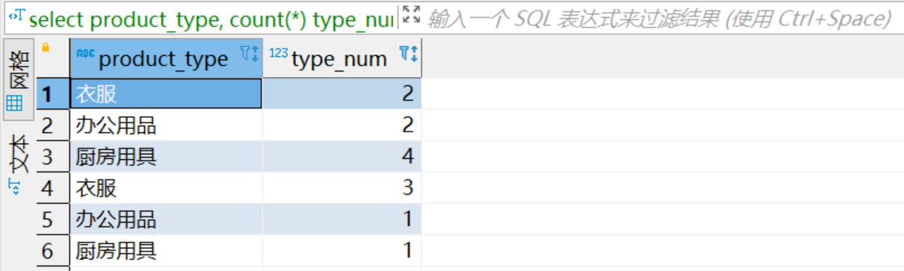
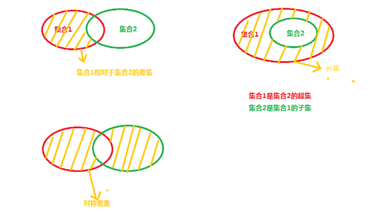
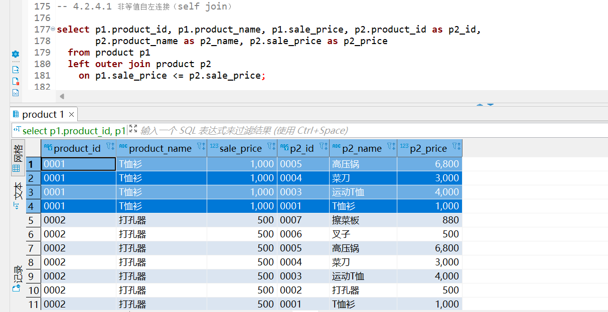

[toc]

# 第四章：集合运算

# 4.1 表的加减法

## **4.1.1 什么是集合运算**

- **表、视图和查询** 的执行结果都是记录的集合
- 其中的 **元素** 为表或者查询结果中的**每一行**

- `集合运算符`

|符号|意义|
|:-:|:-:|
|**`union`**|**并**|
|**`intersect`**|**交**|
|**`except`**|**差**|


## **4.1.2 表的加法 `UNION`**

### ***4.1.2.1 `UNION`***

```sql
SELECT product_id, product_name
  FROM product
 UNION
SELECT product_id, product_name
  FROM product2;
```


【⭕⭕⭕】**UNION 等集合运算符通常都会除去重复的记录**。

【⭕⭕⭕】上述查询是**对不同的两张表进行求并集运算**

【⭕⭕⭕】**对于同一张表, 实际上也是可以进行求并集的**

> **练习题** 
> 假设连锁店想要增加成本利润率超过 50% 或者售价低于 800 的货物的存货量, 请使用 UNION 对分别满足上述两个条件的商品的查询结果求并集。

```sql
-- 参考答案:
SELECT product_id, product_name, product_type, 
       sale_price,purchase_price
  FROM PRODUCT WHERE sale_price < 800
 UNION
SELECT product_id, product_name, product_type,
       sale_price,purchase_price
  FROM PRODUCT WHERE sale_price > 1.5 * purchase_price;
```
思考: 如果不使用 UNION 该怎么写查询语句?

```sql
-- 参考答案:
SELECT product_id, product_name, product_type,
       sale_price,purchase_price
  FROM PRODUCT 
 WHERE sale_price < 800 
    OR sale_price > 1.5 * purchase_price;
```

### ***4.1.2.2 `UNION` 与 `OR` 谓词***

- 若要将 ***两个不同的表*** 中的结果合并在一起, 就不得不使用 `UNION` 了
- 对于同一张表, 有时也会出于查询效率方面的因素来使用 UNION。


【⭕⭕⭕】
> **练习题**
> 分别使用 `UNION` 或者 `OR` 谓词, 找出成本利润率不足 30% 或 成本利润率未知的商品。

参考答案:

```sql
-- 使用 OR 谓词
SELECT * FROM Product 
 WHERE sale_price / purchase_price < 1.3 
    OR sale_price / purchase_price IS NULL;

-- 使用 UNION
SELECT * FROM Product WHERE sale_price / purchase_price < 1.3
 UNION
SELECT * FROM Product WHERE sale_price / purchase_price IS NULL;
```


### ***4.1.2.3 包含重复行的 并运算 `UNION ALL`***

- 【⭕⭕⭕】**`UNION`** 会对两个查询的结果集进行 **合并和去重**
  - 去掉两个结果集相互重复的
  - 去掉一个结果集中的重复行
- 【⭕⭕⭕】保留重复行的并集 **`UNION ALL`**
  - 在 UNION 后面添加 ALL 关键字

> **练习题** 
> `product` 和 `product2` 中所包含的商品种类及每种商品的数量

```sql
-- 保留重复行
SELECT product_type, count(*) FROM Product GROUP BY product_type
UNION ALL
SELECT product_type, count(*) FROM Product2 GROUP BY product_type;
```
  

> **练习题** 
> 商店决定对 `product` 表中成本利润低于50% **或者** 售价低于1000的商品提价。
> 请使用 `UNION ALL` 语句将分别满足上述两个条件的结果取并集

参考答案

```sql
SELECT * FROM Product WHERE sale_price < 1000
UNION ALL
SELECT * FROM Product WHERE sale_price < 1.5 * purchase_price
```


### ***4.1.2.4 隐式数据类型转换***

【⭕⭕⭕】
通常来说, 我们会把类型完全一致, 并且代表相同属性的列使用 UNION 合并到一起显示, 但有时候, 即使数据类型不完全相同, 也会通过隐式类型转换来将两个类型不同的列放在一列里显示, 例如**字符串和数值类型**: 

```sql
SELECT product_id, product_name, '1'
  FROM Product
 UNION
SELECT product_id, product_name,sale_price
  FROM Product2;
```


> **练习题:**
> 【⭕⭕⭕】 **`SYSDATE()`** 函数可以返回当前日期时间,是一个日期时间类型的数据
> 试测试 该数据类型 和 数值,字符串等类型 的兼容性。

```sql
SELECT SYSDATE(), SYSDATE(), SYSDATE()
 UNION
SELECT 'chars', 123,  null
```


以上代码可以正确执行, 说明时间 ***日期类型和字符串*** ,  ***数值以及缺失值均*** 能兼容。

## **4.1.3 交运算 `INTERSECT`**

> 截止到 MySQL 8.0 版本, MySQL 仍然不支持 INTERSECT 操作。
> 【⭕⭕⭕】此时需要用 ***`inner join`*** 来求得交集

```sql
SELECT product_id, product_name
  FROM Product
INTERSECT
SELECT product_id, product_name
  FROM Product2
```

>错误代码：1064
>You have an error in your SQL syntax; check the manual that corresponds to your MySQL server version for the right syntax to use near 'SELECT product_id, product_name
>FROM Product2

【⭕⭕⭕】此时需要用 ***`inner join`*** 来求得交集
```sql
SELECT p1.product_id, p1.product_name
  FROM Product p1
 INNER JOIN Product2 p2
    ON p1.product_id=p2.product_id
```

## **4.1.4 差集、补集 与 表的减法**

  


集合 A 和 B 做减法 只是将集合A中也同时属于集合B的元素减掉。


### ***4.1.4.1 差运算 `EXCEPT`***

`MySQL 8.0` 还不支持 `EXCEPT` 运算

借助 `NOT IN` 谓词, 我们同样可以实现表的减法。

**练习题:**

找出只存在于Product表但不存在于Product2表的商品。

```sql
SELECT * 
  FROM Product
 WHERE product_id NOT IN (SELECT product_id 
                            FROM Product2)
```

### ***4.1.4.2 `EXCEPT` 与 `NOT IN` 谓词***

使用 `NOT IN` 谓词, 基本上可以实现和SQL标准语法中的 `EXCEPT` 运算相同的效果。

> **练习题**
> 求出 product 表中, 售价高于2000 ,但成本利润率不低于30%的商品


```sql
--  参考答案
SELECT * 
  FROM Product
 WHERE sale_price > 2000 
   AND product_id NOT IN (SELECT product_id 
                            FROM Product 
                           WHERE sale_price < 1.3 * purchase_price)
```

### ***4.1.4.3 `INTERSECT` 与 `AND` 谓词***

***交运算 `INTERSECT`*** 实际上可以等价地将两个查询的检索条件用 AND 谓词连接来实现。

> **练习题**
> 使用AND谓词查找product表中利润率高于50%,并且售价低于1500的商品,查询结果如下所示。


```sql
-- 参考答案
SELECT * 
  FROM Product
 WHERE sale_price > 1.5 * purchase_price 
   AND sale_price < 1500;

-- 自己: inner join 方式
select P1.*
  from (select *
		  from product
		 where sale_price > 1.5 * purchase_price) as P1
 INNER JOIN (select * 
			  from product
			 where sale_price < 1500) as P2
    on P1.product_id = P2.product_id;
```

## **4.1.5 对称差**

> **两个集合 A, B 的对称差是指那些 仅属于A或仅属于B的元素 构成的集合**

- 【⭕⭕⭕】**两个集合的交** 就可以看作是 **两个集合的并** 去掉 **两个集合的对称差** （首先使用 `UNION` 求两个表的并集, 然后使用 `INTERSECT` 求两个表的交集, 然后用并集减去交集, 就得到了对称差。）
- 【⭕⭕⭕】**两个集合的对称差等于 A-B 并 B-A**

> **练习题**
> 使用Product表和Product2表的对称差来查询哪些商品只在其中一张表


```sql
-- 使用 NOT IN 实现两个表的差集
-- A-B 并 B-A
SELECT * 
  FROM Product
 WHERE product_id NOT IN (SELECT product_id FROM Product2)
UNION
SELECT * 
  FROM Product2
 WHERE product_id NOT IN (SELECT product_id FROM Product)
```

### ***4.1.5.1 借助并集和差集迂回实现交集运算 `INTERSECT`***

> 两个集合的交可以看作是两个集合的并去掉两个集合的对称差。


# 小结
|集合运算|符号|对应谓词|说明|
|:-:|:-:|:-:|:-|
|并集|`union`|`or`|`union`去除重复记录（行）|
|并集|`union all`||`union all`保留重复记录（行）|
|交|`intersect`|`and`|MySQL8.0 不支持该集合运算符，可以通过 `inner join`或`and`求交集|
|差|`except`|`not in`|MySQL8.0 不支持该集合运算符|
|对称差|`union - intersect`|`not in、union`|`对称差等于 A-B 并上 B-A` **或** `两个集合的并去掉两个集合的交`|

# 4.2 联结

前一节我们学习了 ***`UNION`*** 和 ***`INTERSECT`*** 等集合运算, 这些集合运算的特征就是 ***以行为单位*** 进行操作


> **关联子查询** 可以从其他表获取信息
> 
> **连结** 更适合从多张表获取信息。

SQL 中的连结有多种分类方法
- ***内连结***
- ***外连结***

## **4.2.1 内连结 (`INNER JOIN`)**

```sql
-- 内连结
FROM <tb_1> INNER JOIN <tb_2> ON <condition(s)>
```
### ***4.2.1.1 使用内连结从两个表获取信息***

> 例如: 
> 找出某个商店里的衣服类商品的名称,数量及价格等信息。

<div align=center>
    </img>
</div>

<div align=center>
    </img>
</div>

所以问题的关键是, 找出一个类似于"轴"或者"桥梁"的 **公共列** , 利用这个列将两张表连结起来。
<div align=center>
    </img>
</div>

【⭕⭕⭕】【⭕⭕⭕】
> 注:
> **关联子查询** 
> 以表 A 为主表, 然后根据表 A 的关联列的每一行的取值, 逐个到表 B 中的关联列中去查找取值相等的行。
> **①** 当数据量较少时, 这种方式并不会有什么性能问题
> **②** 但数据量较大时, 这种方式将会导致较大的计算开销。

按照内连结的语法, 在 FROM 子句中使用 INNER JOIN 将两张表连接起来, 并为 ON 子句指定连结条件为 ShopProduct.product_id = Product.product_id

```sql
select s.shop_id, s.shop_name, s.product_id, 
       p.product_name , p.product_type ,s.quantity 
  from product as p 
 inner join shopproduct as s
    on p.product_id = s.product_id;
```

<div align=center>
    </img>
</div>

> 关于内连结,需要注意以下三点:
> **要点一: 进行连结时需要在 `FROM` 子句中使用多张表.**
> **要点二: 必须使用 `ON` 子句来指定连结条件.**
> **要点三: `SELECT` 子句中的列最好按照 `表名.列名` 的格式来使用。**
> 
> 没有名称相同的列的时候, 也可以不写表名
> 
> 但表名使得我们能够在今后的任何时间阅读查询代码的时候, 都能马上看出每一列来自于哪张表, 能够节省我们很多时间。

### ***4.2.1.2 结合 *`WHERE`* 子句使用内连结***

如果需要在使用内连结的时候同时使用 `WHERE` 子句对检索结果进行筛选, 则需要把 `WHERE` 子句写在 `ON` 子句的后边。

- **第一种增加 `WEHRE` 子句的方式**
就是把上述查询作为子查询, 用括号封装起来, 然后在外层查询增加筛选条件。

```sql
SELECT *
  FROM (-- 第一步查询的结果
       select s.shop_id, s.shop_name, s.product_id,
		p.product_name, p.product_type, s.quantity 
         from product p 
        inner join shopproduct s
           on p.product_id = s.product_id;
       ) AS STEP1
 WHERE shop_name = '东京' AND product_type = '衣服' ;
```
这种写法能很清晰地分辨出每一个操作步骤, 在我们还不十分熟悉 SQL 查询每一个子句的执行顺序的时候可以帮到我们。

- **第二种增加 WEHRE 子句的方式**
但实际上, 如果我们熟知 WHERE 子句将在 FROM 子句之后执行, 也就是说, 在做完 INNER JOIN ... ON 得到一个新表后, 才会执行 WHERE 子句, 那么就得到标准的写法:


```sql
select s.shop_id, s.shop_name, s.product_id,
       p.product_name, p.product_type, s.quantity 
  from product p 
 inner join shopproduct s
    on p.product_id = s.product_id;
 WHERE s.shop_name = '东京' AND p.product_type = '衣服';
```
我们首先给出上述查询的执行顺序:

> ⭕⭕⭕ **`FROM 子句` —> `WHERE 子句` —> `SELECT 子句`**

也就是说, 两张表是先按照**连结列**进行了连结 **INNER JOIN**, 得到了一张新表, 然后 **WHERE** 子句对这张新表的行按照两个条件进行了筛选,  最后, **SELECT** 子句选出了那些我们需要的列。

- **第三种增加 WEHRE 子句的方式**
  将 **WHERE** 子句中的条件直接添加在 **ON** 子句中（***不建议使用***）

```sql
select s.shop_id, s.shop_name, s.product_id,
       p.product_name, p.product_type, s.quantity 
  from product p 
 inner join shopproduct s
    on (p.product_id = s.product_id and SP.shop_name = '东京' and P.product_type = '衣服');
```

---
---

另外, **先连结再筛选**的标准写法的执行顺序是, 两张完整的表做了连结之后再做筛选,如果要连结多张表, 或者需要做的筛选比较复杂时, 在写 SQL 查询时会感觉比较吃力. 在结合 WHERE 子句使用内连结的时候, 我们也可以更改任务顺序, 并采用任务分解的方法, ***先分别在两个表使用 WHERE 进行筛选, 然后把上述两个子查询连结起来。***


- **第四种增加 WEHRE 子句的方式**
  先分别在两个表使用 WHERE 进行筛选, 然后把上述两个子查询连结起来。
```sql
SELECT s.shop_id, s.shop_name, s.product_id, p.product_name, p.product_type, p.sale_price, s.quantity
  FROM (-- 子查询 1:从 shopproduct 表筛选出东京商店的信息
        SELECT * FROM shopproduct WHERE shop_name = '东京' ) AS SP
 INNER JOIN -- 子查询 2:从 product 表筛选出衣服类商品的信息
       (SELECT * FROM product WHERE product_type = '衣服') AS P
    ON SP.product_id = P.product_id;
```
先分别在两张表里做筛选, 把复杂的筛选条件按表分拆, 然后把筛选结果连接起来, 避免了写复杂的筛选条件, 因此这种看似复杂的写法, 实际上整体的逻辑反而非常清晰. 在写查询的过程中, 首先要按照最便于自己理解的方式来写, 先把问题解决了, 再思考优化的问题。

> **练习题**
> 找出每个商店里的"衣服"类商品的名称及价格等信息. 希望得到如下结果:

 

```sql
-- 参考答案 1--不使用子查询（相当于先联结再筛选）
SELECT  SP.shop_id,SP.shop_name,SP.product_id 
       ,P.product_name, P.product_type, P.purchase_price
  FROM shopproduct  AS SP 
 INNER JOIN Product AS P 
    ON SP.product_id = P.product_id
 WHERE P.product_type = '衣服';

-- 参考答案 2--使用子查询（相当于先筛选再联结）
SELECT  SP.shop_id, SP.shop_name, SP.product_id
       ,P.product_name, P.product_type, P.purchase_price
  FROM shopproduct AS SP 
 INNER JOIN --从 Product 表找出衣服类商品的信息
      (SELECT product_id, product_name, product_type, purchase_price
         FROM Product	
        WHERE product_type = '衣服') AS P 
    ON SP.product_id = P.product_id;
```

> **练习题** 
> 分别使用连结两个子查询和不使用子查询的方式
> 找出东京商店里, 售价低于 2000 的商品信息,希望得到如下结果。


```sql
-- 参考答案
-- 不使用子查询
SELECT SP.*, P.*
  FROM shopproduct AS SP 
 INNER JOIN product AS P 
    ON SP.product_id = P.product_id
 WHERE shop_id = '000A'
   AND sale_price < 2000;

-- 我的答案
select * 
  from shopproduct s
 inner join product p
 	on s.product_id = p.product_id
 where s.shop_id = '000A' and p.sale_price < 2000;

select *
  from (select * from shopproduct where shop_id = '000A') as s
 inner join (select * from product where sale_price < 2000) as p
 	on s.product_id = p.product_id;
```

### ***4.2.1.3 结合 `GROUP BY` 子句使用内连结***

> 需要根据分组列位于哪个表区别对待。

- 最简单的情形, 是在内连结之前就使用 GROUP BY 子句. 

- 但是如果 ***分组列*** 和 ***被聚合的列*** 不在同一张表, 且二者都未被用于连结两张表, 则只能 先连结再聚合 。

> **练习题**
> 每个商店中, 售价最高的商品的售价分别是多少?

```sql
-- 参考答案
SELECT SP.shop_id
      ,SP.shop_name
      ,MAX(P.sale_price) AS max_price
  FROM shopproduct AS SP
 INNER JOIN product AS P
    ON SP.product_id = P.product_id
 GROUP BY SP.shop_id,SP.shop_name
```
**思考题:**

上述查询得到了每个商品售价最高的商品, 但并不知道售价最高的商品是哪一个.如何获取每个商店里售价最高的商品的名称和售价?
>注: 这道题的一个简易的方式是使用下一章的窗口函数. 当然, 也可以使用其他我们已经学过的知识来实现, 例如, 在找出每个商店售价最高商品的价格后, 使用这个价格再与 Product 列进行连结, 但这种做法在价格不唯一时会出现问题。

### ***4.2.1.4 自连结(`SELF JOIN`)***

> 一张表也可以与自身作连结, 这种连接称之为自连结
> 
> 需要注意, 自连结并不是区分于内连结和外连结的第三种连结, 自连结可以是外连结也可以是内连结, 它是不同于内连结外连结的另一个连结的分类方法。

### ***4.2.1.5 内连结 与 关联子查询***

回忆第五章第三节关联子查询中的问题: 找出每个商品种类当中售价高于该类商品的平均售价的商品.当时我们是使用关联子查询来实现的。

```sql
select product_type, product_name, sale_price
  from product as P1
 where sale_price > (select avg(sale_price)
                       from product as P2
                      where P1.product_type = P2.product_type
                      group by product_type);
```

使用内连结同样可以解决这个问题:
```sql
-- 首先, 使用 GROUP BY 按商品类别分类计算每类商品的平均价格。
select product_type, avg(sale_price) as avg_price 
  from Product 
 group by product_type;

-- 接下来, 将上述查询与表 Product 按照 product_type (商品种类)进行内连结。
select p1.product_id, p1.product_name, p1.product_type, p1.sale_price, p2.avg_price
  from product as p1
 inner join (select product_type, avg(sale_price) as avg_price
 		 from product
 		group by product_type) as p2
    on p1.product_type = p2.product_type;

-- 最后, 增加 WHERE 子句, 找出那些售价高于该类商品平均价格的商品.完整的代码如下:
select p1.product_id, p1.product_name, p1.product_type, p1.sale_price, p2.avg_price
  from product as p1
 inner join (select product_type, avg(sale_price) as avg_price
 		 from product
 		group by product_type) as p2
    on p1.product_type = p2.product_type
 where p1.sale_price > p2.avg_price;
```
仅仅从代码量上来看, 上述方法似乎比关联子查询更加复杂, 但这并不意味着这些代码更难理解. 通过上述分析, 很容易发现上述代码的逻辑实际上更符合我们的思路, 因此尽管看起来复杂, 但思路实际上更加清晰。

### ***4.2.1.6 自然连结(`NATURAL JOIN`)***

> **内连结的一种特例**
> 
> 当两个表进行自然连结时, 会按照两个表中都包含的列名来进行 逐字段 ***等值内连结*** , 此时无需使用 ON 来指定连接条件。   

```sql
SELECT *  FROM shopproduct NATURAL JOIN product
```
上述查询得到的结果, 会把两个表的公共列(这里是 product_id, 可以有多个公共列)放在第一列, 然后按照两个表的顺序和表中列的顺序, 将两个表中的其他列都罗列出来。


使用自然连结还可以求出 两张表或子查询 的公共部分, 例如教材中 7-1 选取表中公共部分--INTERSECT 一节中的问题: 求表 Product 和表 Product2 中的公共部分, 也可以用自然连结来实现:

```sql
SELECT * FROM Product NATURAL JOIN Product2
```


这个结果和书上给的结果并不一致, 少了运动 T 恤, 这是由于运动 T 恤的 regist_date 字段为空, ***在进行自然连结时, 来自于 Product 和 Product2 的运动 T 恤这一行数据在进行比较时, 实际上是在逐字段进行等值连结***, 回忆我们在 `3.4.4 ISNULL,IS NOT NULL` 这一节学到的缺失值的比较方法就可得知, **两个缺失值用等号进行比较, 结果不为真. 而连结只会返回对连结条件返回为真的那些行。**

如果我们将查询语句进行修改:

```sql
 SELECT * 
   FROM (SELECT product_id, product_name
          FROM Product ) AS A 
NATURAL JOIN 
        (SELECT product_id, product_name 
           FROM Product2) AS B;
```
那就可以得到正确的结果了:


### ***4.2.1.7 使用连结求交集***

> **练习题**
> 使用内连结求 Product 表和 Product2 表的交集。

```sql
select p1.*
  from product as p1
 inner join product2 as p2
    ON (P1.product_id  = P2.product_id
       AND P1.product_name = P2.product_name
       AND P1.product_type = P2.product_type
       AND P1.sale_price   = P2.sale_price
       AND P1.regist_date  = P2.regist_date)
```
得到如下结果


注意上述结果和 P230 的结果并不一致--少了 product_id='0003'这一行, 观察源表数据可发现, 少的这行数据的 regist_date 为缺失值, 回忆第六章讲到的 IS NULL 谓词, 我们得知, 这是由于缺失值是不能用等号进行比较导致的。

如果我们仅仅用 product_id 来进行连结:

```sql
SELECT P1.*
  FROM Product AS P1
 INNER JOIN Product2 AS P2
    ON P1.product_id = P2.product_id
```
查询结果:


这次就一致了。

## **4.2.2 外连结(OUTER JOIN)**

⭕⭕⭕
- **内连结** 会丢弃两张表中不满足 ON 条件的行
- **外连结** 会根据外连结的种类 **有选择地保留无法匹配到的行**。

⭕⭕⭕
按照保留的行位于哪张表外,连结有三种形式: 
- **左连结**
  会保存左表中无法按照 ON 子句匹配到的行, 此时对应右表的行均为缺失值
- **右连结**
  会保存右表中无法按照 ON 子句匹配到的行, 此时对应左表的行均为缺失值
- **全外连结**
  会同时保存两个表中无法按照 ON 子句匹配到的行, 相应的另一张表中的行用缺失值填充。

```sql
-- 左连结     
FROM <tb_1> LEFT  OUTER JOIN <tb_2> ON <condition(s)>
-- 右连结     
FROM <tb_1> RIGHT OUTER JOIN <tb_2> ON <condition(s)>
-- 全外连结
FROM <tb_1> FULL  OUTER JOIN <tb_2> ON <condition(s)>
```

### ***4.2.2.1 左连结与右连结***

> 由于连结时可以交换左表和右表的位置, 因此左连结和右连结并没有本质区别

接下来我们先以左连结为例进行学习. 所有的内容在调换两个表的前后位置, 并将左连结改为右连结之后, 都能得到相同的结果

### ***4.2.2.2 左连结***
   
> **练习题**
> 统计每种商品分别在哪些商店有售, 需要包括那些在每个商店都没货的商品。
```sql
SELECT SP.shop_id
       ,SP.shop_name
       ,SP.product_id
       ,P.product_name
       ,P.sale_price
  FROM Product AS P
  LEFT OUTER JOIN ShopProduct AS SP
    ON SP.product_id = P.product_id;
```
上述查询得到的检索结果如下(由于并未使用 ORDER BY 子句指定顺序,你执行上述代码得到的结果可能顺序与下图不同):


我们观察上述结果可以发现, 有两种商品: 高压锅和圆珠笔, 在所有商店都没有销售

**● 外连结要点 1: 选取出单张表中全部的信息**

与内连结的结果相比, 不同点显而易见, 那就是 ***结果的行数不一样***. 内连结的结果中有 13 条记录,而外连结的结果中有 15 条记录,增加的 2 条记录到底是什么呢? 这正是外连结的关键点. ***多出的 2 条记录是高压锅和圆珠笔***, 这 2 条记录在 ShopProduct 表中并不存在,也就是说,这 2 种商品在任何商店中都没有销售. 由于 ***内连结只能选取出同时存在于两张表中的数据*** , 因此只在 Product 表中存在的 2 种商品并没有出现在结果之中. 相反,***对于外连结来说,只要数据存在于某一张表当中,就能够读取出来***

在实际的业务中, 例如想要生成固定行数的单据时,就需要使用外连结.如果使用内连结的话, 根据 SELECT 语句执行时商店库存状况的不同,结果的行数也会发生改变, 生成的单据的版式也会受到影响, 而使用外连结能够得到固定行数的结果. 虽说如此, 那些表中不存在的信息我们还是无法得到,结果中高压锅和圆珠笔的商店编号和商店名称都是 NULL. 外连结名称的由来也跟 NULL 有关, 即  ***结果中包含原表中不存在（在原表之外）的信息***. 相反,***只包含表内信息*** 的连结也就被称为内连结了。

**● 外连结要点 2：使用 *`LEFT、RIGHT`* 来指定主表.**

外连结还有一点非常重要, ***那就是要把哪张表作为主表***. 最终的结果中会包含主表内所有的数据, ***通常使用 LEFT 的情况会多一些。***

***通过交换两个表的顺序, 同时将 LEFT 更换为 RIGHT(如果原先是 RIGHT,则更换为 LEFT), 两种方式会到完全相同的结果。***
### ***4.2.2.3 结合 *`WHERE`* 子句使用左连结***

由于外连结的结果很可能与内连结的结果不一样, 会包含那些主表中无法匹配到的行, 并用缺失值填写另一表中的列, 由于这些行的存在, 因此在外连结时使用 WHERE 子句, 情况会有些不一样. 我们来看一个例子:

> **练习题**
> 使用 外连结 从 ShopProduct 表和 Product 表中找出那些在某个商店库存少于50的商品及对应的商店.希望得到如下结果。


注意高压锅和圆珠笔两种商品在所有商店都无货, 所以也应该包括在内。

按照"***结合WHERE子句使用内连结***"的思路, 我们很自然会写出如下代码

```sql
SELECT P.product_id
       ,P.product_name
       ,P.sale_price
       ,SP.shop_id
       ,SP.shop_name
       ,SP.quantity
  FROM Product AS P
  LEFT OUTER JOIN ShopProduct AS SP
    ON SP.product_id = P.product_id
 WHERE quantity< 50
```
然而不幸的是, 得到的却是如下的结果:


观察发现, 少了在所有商店都无货的高压锅和圆珠笔. 聪明的你可能很容易想到，在WHERE过滤条件中增加 **`OR quantity IS NULL`** 的条件, 便可以得到预期的结果。然而在真实的查询环境中, 由于数据量大且数据质量并非设想的那样"干净", 我们并不能容易地意识到缺失值等问题数据的存在, 因此,还是让我们想一下如何改写我们的查询以使得它能够适应更复杂的真实数据的情形吧。

联系到我们已经掌握了的 **SQL查询的执行顺序(`FROM->WHERE->SELECT`)** , 我们发现, 问题可能出在筛选条件上, 因为在进行完外连结后才会执行 WHERE 子句, 因此那些主表中无法被匹配到的行就被 WHERE 条件筛选掉了。

明白了这一点, 我们就可以试着把 WHERE 子句挪到外连结之前进行: 先写个子查询, 用来从ShopProduct 表中筛选 quantity<50 的商品, 然后再把这个子查询和主表连结起来。

我们把上述思路写成SQL查询语句:

```sql
select p.product_id, p.product_name, p.sale_price, s.shop_id, s.shop_name, s.quantity
  from product as p
  left outer join (select * from shopproduct where quantity < 50) as s
    on p.product_id = s.product_id;
```

<div align=center>
    </img>
</div>

### ***4.2.2.4 全外连结***

有了对左连结和右连结的了解, 就不难理解全外连结的含义了. 

> 全外连结本质上就是 ***对左表和右表的所有`行`都予以保留*** , 能用 ON 关联到的就把左表和右表的内容在一行内显示, 不能被关联到的就分别显示, 然后把多余的列用缺失值填充。

遗憾的是, MySQL8.0 目前还不支持全外连结, 不过我们可以***对左连结和右连结的结果进行 UNION 来实现全外连结***。

## **4.2.3 多表连结**

通常连结只涉及 2 张表,但有时也会出现必须同时连结 3 张以上的表的情况, 原则上连结表的数量并没有限制。

### ***4.2.3.1 多表内连结***

首先创建一个用于三表连结的表 InventoryProduct. 首先我们创建一张用来管理库存商品的表,  假设商品都保存在 P001 和 P002 这 2 个仓库之中。


接下来, 我们根据上表及 ShopProduct 表和 Product 表, ***使用内连接找出每个商店都有那些商品, 每种商品的库存总量分别是多少***。
```sql
SELECT SP.shop_id
       ,SP.shop_name
       ,SP.product_id
       ,P.product_name
       ,P.sale_price
       ,IP.inventory_quantity
  FROM ShopProduct AS SP
 INNER JOIN Product AS P
    ON SP.product_id = P.product_id
 INNER JOIN InventoryProduct AS IP
    ON SP.product_id = IP.product_id
 WHERE IP.inventory_id = 'P001';
```

<div align=center>
    </img>
</div>

### ***4.2.3.2 多表外连结***

正如之前所学发现的, 外连结一般能比内连结有更多的行, 从而能够比内连结给出更多关于主表的信息, 多表连结的时候使用外连结也有同样的作用。

```sql
SELECT P.product_id, P.product_name, P.sale_price,
       SP.shop_id, SP.shop_name, IP.inventory_quantity
  FROM Product AS P
  LEFT OUTER JOIN ShopProduct AS SP
    ON SP.product_id = P.product_id
  LEFT OUTER JOIN InventoryProduct AS IP
    ON SP.product_id = IP.product_id
```
查询结果


## ***4.2.4 ON 子句进阶--非等值连结***

在刚开始介绍连结的时候, 书上提到过, 除了使用相等判断的等值连结, 也可以使用比较运算符来进行连接. 实际上, ⭕⭕⭕**包括比较运算符(<,<=,>,>=, BETWEEN)和谓词运算(LIKE, IN, NOT 等等)在内的所有的逻辑运算都可以放在 ON 子句内作为连结条件。**

### ***4.2.4.1 非等值自左连结(SELF JOIN)***

> **使用非等值自左连结实现排名**

> **练习题**
> 使用自左连结的思路是: 对每一种商品,找出售价不低于它的所有商品, 然后对售价不低于它的商品使用 COUNT 函数计数

```sql
SELECT  product_id
       ,product_name
       ,sale_price
       ,COUNT(p2_id) AS my_rank
  FROM (--使用自左连结对每种商品找出价格不低于它的商品
        SELECT P1.product_id, 
               P1.product_name, 
               P1.sale_price, 
               P2.product_id AS P2_id, 
               P2.product_name AS P2_name, 
               P2.sale_price AS P2_price
          FROM Product AS P1 
          LEFT OUTER JOIN Product AS P2 
            ON P1.sale_price <= P2.sale_price 
        ) AS X  -- 这里必须要写 AS X 不然会报错
 GROUP BY product_id, product_name, sale_price
 ORDER BY my_rank; 
```

<div align=center>
    </img>
</div>


- 注 1: **`COUNT` 函数的**
  - **⭕⭕⭕参数是 `列名`时, 会忽略该列中的缺失值**
  - **⭕⭕⭕参数是 `*` 时, 则不忽略缺失值**
- 注 2: 上述排名方案存在一些问题--**如果两个商品的价格相等**, 则会导致两个商品的排名错误, 例如,  叉子和打孔器的排名应该都是第六, 但上述查询导致二者排名都是第七. 试修改上述查询使得二者的排名均为第六。

<div align=center>
    </img>
</div>

- 注 3: 实际上, 进行排名有专门的函数

### ***非等值 自左连结 累计求和***

> 解决上述 “**注 2**” 的问题
> **练习题**
> 请按照商品的售价从低到高,对售价进行累计求和

首先, 按照题意, 对每种商品使用自左连结, 找出比该商品售价价格更低或相等的商品

```sql
SELECT  P1.product_id
       ,P1.product_name
       ,P1.sale_price
       ,P2.product_id AS P2_id
       ,P2.product_name AS P2_name
       ,P2.sale_price AS P2_price 
  FROM Product AS P1 
  LEFT OUTER JOIN Product AS P2 
    ON P1.sale_price >= P2.sale_price
 ORDER BY P1.sale_price,P1.product_id	
```
查看查询结果


看起来似乎没什么问题。

下一步, 按照 P1.product_Id 分组,对 P2_price 求和:

```sql
SELECT  product_id
       ,product_name
       ,sale_price
       ,SUM(P2_price) AS cum_price 
  FROM (SELECT  P1.product_id
               ,P1.product_name
               ,P1.sale_price
               ,P2.product_id AS P2_id
               ,P2.product_name AS P2_name
               ,P2.sale_price AS P2_price 
          FROM Product AS P1 
          LEFT OUTER JOIN Product AS P2 
            ON P1.sale_price >= P2.sale_price
         ORDER BY P1.sale_price,P1.product_id ) AS X
 GROUP BY product_id, product_name, sale_price
 ORDER BY sale_price,product_id;
```
得到的查询结果为:


观察上述查询结果发现, 由于有两种商品的售价相同, 在使用 >= 进行连结时, 导致了累计求和错误, 这是由于这两种商品售价相同导致的. 因此实际上之前是不应该单独只用 >= 作为连结条件的. 考察我们⭕⭕⭕**建立自左连结的本意**, 是要找出满足:

- 1.比该商品售价更低的, 或者是 
- 2.该种商品自身, 以及 
- 3.如果 A 和 B 两种商品售价相等,则建立连结时, 如果 P1.A 和 P2.A, P2.B 建立了连接, 则 P1.B 不再和 P2.A 建立连结, 因此根据上述约束条件, 利用 ID 的有序性, 进一步将上述查询改写为:

```sql
SELECT product_id, product_name, sale_price, 
       SUM(P2_price) AS cum_price 
  FROM
        (SELECT  P1.product_id, P1.product_name, P1.sale_price
                ,P2.product_id AS P2_id
                ,P2.product_name AS P2_name
                ,P2.sale_price AS P2_price 
           FROM Product AS P1 
           LEFT OUTER JOIN Product AS P2 
             ON (
                  (P1.sale_price > P2.sale_price)
                  OR 
                  (P1.sale_price = P2.sale_price AND P1.product_id <= P2.product_id)
                )
	      ORDER BY P1.sale_price,P1.product_id) AS X
 GROUP BY product_id, product_name, sale_price
 ORDER BY sale_price,cum_price;
```
这次结果就正确了.


# 练习题

## **4.1** 

找出 product 和 product2 中售价高于 500 的商品的基本信息。

## **4.2**

借助对称差的实现方式, 求product和product2的交集。

## **4.3**

每类商品中售价最高的商品都在哪些商店有售 ？

## **4.4**

分别使用内连结和关联子查询每一类商品中售价最高的商品。

## **4.5** 

用关联子查询实现：在 product 表中，取出 product_id, product_name, sale_price, 并按照商品的售价从低到高进行排序、对售价进行累计求和。
